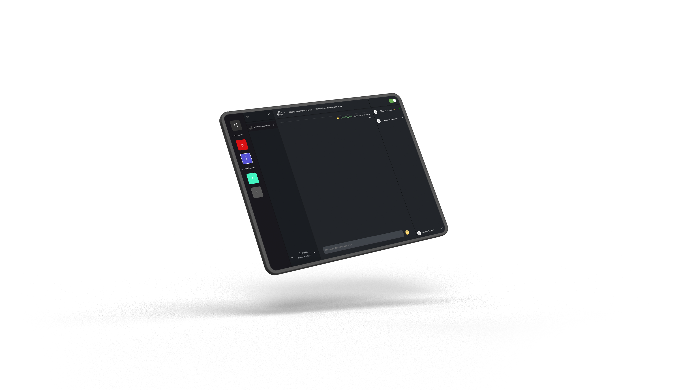
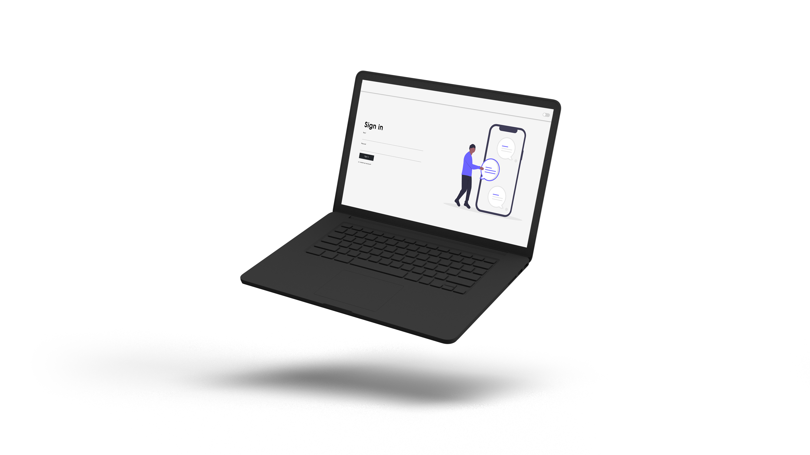

## Discord clone chat app

Real time discord clone chat app

### `Quick description`

In March I decided to take a step forward and create something more complicated.
This discord chat app clone was just created to learn Socket.io in more complex approach.
Through all this develop process I have learnt about Socket rooms, namespaces and user
authentication through socket connections. In my opinion this chat app is a good base
to even bigger projects. This one is still being developed. Mobile resolutions
are not finished just because I have plans to create the same project but in React Native
for mobile devices.

#### `Technologies used:`

`Frontend`

- React / Redux
- Styled components

`Backend`

- NodeJS
- Socket.io
- MongoDB

